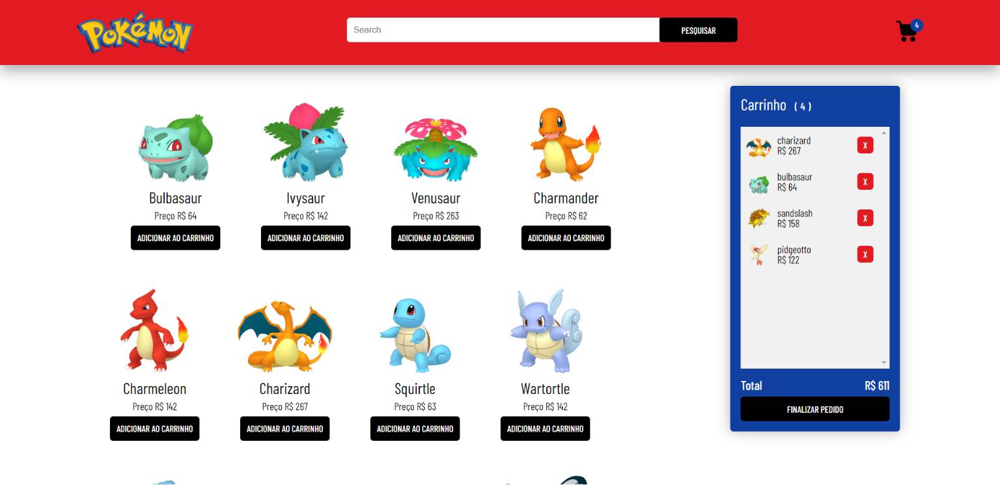
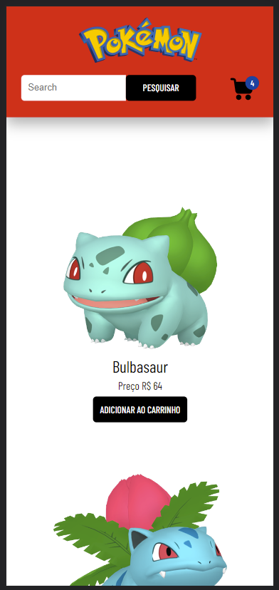

# PokeStore
## Loja de pokemon
Projeto criado simulando uma loja virtual de Pokemon

### Principais Componentes
- [ x ] Componente de pesquisa de pokemon
- [ x ] Componente de listagem de pokemon
- [ x ] Componente de card individual do pokemon
- [ x ] Componente de minicart
- [ x ] Componente de pedido finalizado  
- [ ... ] Criação de uma PDP dom os demais detalhes do pokemon

### Tecnologias
- React com typescript
- Hooks
  - useState
  - useEffect
  - useContext

### Funcionalidades
- [ ... ] Filtragem dinâmica conforme é digitado
- [ x ] Adicionar e remover items do minicart
- [ x ] Ocultar e exibir o minicart
- ...

### ScreenShot
 
